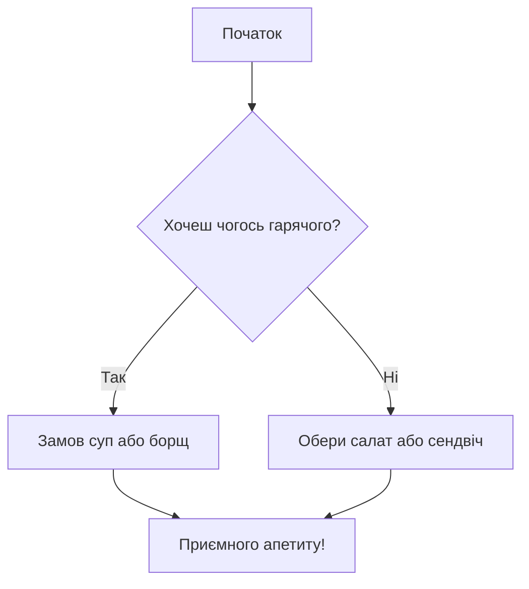

# Лабораторна робота №3
Виконала студентка групи ІКМ-123 Солом'яна Поліна

## Тема: Markdown - створення документа, діаграми та публікація на Github
### Мета роботи
Навчитися створювати структурований документ у Markdown, додавати списки, математичні формули, діаграми (Mermaid), конвертувати Markdown у HTML/DOCX/PDF і опублікувати результат на Github.

### Мої улюблені книги
* **"Час жити і вмирати"** - *Еріх Марія Ремарк*
* **"Гарних дівчат не вбивають"** - *Холлі Джексон*
* **"1984"** - *Джордж Оруел*
* **"Гордість і упередженість"** - *Джейн Остін*
* **"Пригоди Шерлока Холмса"** - *Артур Конан Дойл*

### Відомі математичні формули

#### 1. Закон Ома для ділянки ланцюга
Закон, що пов'язує силу струму ($I$), напругу ($U$) та опір ($R$), описується формулою: $I = \frac{U}{R}$

#### 2. Формула Ньютона-Лейбніца
Пов'язує поняття інтегрування та диференціювання, як показано у рівнянні:
$$\int_{a}^{b} f(x) \,dx=F(b) - F(a)$$

#### 3. Теорема Піфагора
Формула, що пов'язує довжини сторін прямокутного трикутника:

$$a^2 + b^2 = c^2$$

### Проста діагарама

### Таблиця

|№| Назва книги та автор | Кількість сторінок |
| :---: | :--- | :---: |
| 1 | "Час жити і помирати" - Еріх Марія Ремарк | 400 |
| 2 | "Гарних дівчат не вбивають" - Холлі Джексон | 272 |
| 3 | "1984" - Джордж Оруел | 328 |
| 4 | "Гордість і упередженість" - Джейн Остін | 384 |
| 5 | "Пригоди Шерлока Холмса" - Артур Конан Дойл | 352 |

### Висновки
В ході лабораторної роботи успішно досягли поставленої мети - набуття навичок створення структурованого документа у форматі Markdown. Опанували ключовий синтаксис, реалізували оформлення ієрархічних заголовків, маркованих списків, математичних формул та побудували просту діаграму.
