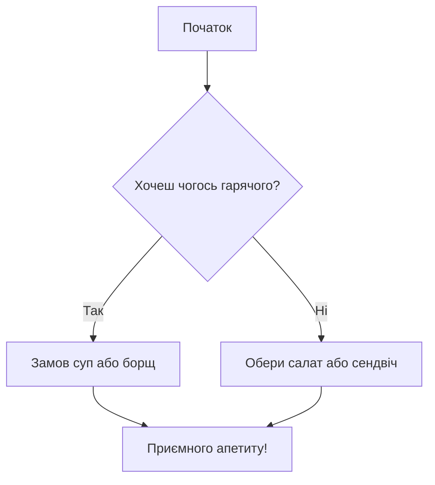

# Лабораторна робота №3
## Тема: Markdown - створення документа, діаграми та публікація на Github
### Мета роботи
Навчитися створювати структурований документ у Markdown, додавати списки, математичні формули, діагарми (Mermaid), конвертувати Markdown у HTML/ DOCX/ PDF і опублікувати результат на Github
### Мої улюблені книги:
* **"Час жити і вмирати"** - *Еріх Марія Ремарк*
* **"Гарних дівчат не вбивають"** - *Холлі Джексон*
* **"1984"** - *Джордж Оруел*
* **"Гордість і упередженість"** - *Джейн Остін*
* **"Пригоди Шерлока Холмса"** - *Артур Конан Дойл*

### Відомі математичні формули

#### 1. Закон Ома для ділянки ланцюга
Закон, що пов'язує силу струму, напругу та опір, описується формулою:
$$
I = \frac{U}{R}
$$

#### 2. Формула Ньютона-Лейбніца
Пов'язує поняття інтегрування та диференціювання, як показано у рівнянні:
$$
\int_{a}^{b} f(x)\,dx = F(b) - F(a)
$$

#### 3. Теорема Піфагора
Формула, що пов'язує довжини сторін прямокутного трикутника:
$$
a^2 + b^2 = c^2
$$

### Проста діаграма

```mermaid
graph TD
    A[Початок] --> B{Хочеш чогось гарячого?};
    B -- Так --> C[Замов суп або борщ];
    B -- Ні --> D[Обери салат або сендвіч];
    C --> E[Приємного апетиту!];
    D --> E;
``` 

### Таблиця улюблених книг

| № | Назва книги та автор | Кількість сторінок |
| :---: | :--- | :---: |
| 1 | "Час жити і помирати" - Еріх Марія Ремарк | 400 |
| 2 | "Гарних дівчат не вбивають" - Холлі Джексон | 272 |
| 3 | "1984" - Джордж Оруел | 328 |
| 4 | "Гордість і упередженість" - Джейн Остін | 384 |
| 5 | "Пригоди Шерлока Холмса" - Артур Конан Дойл | 352 |

### Контрольні запитання
**Що таке Markdown і для чого він використовується?**
Легка мова розмітки, яка дозволяє форматувати текст за допомогою простих символів, зберігаючи його читабельність у вихідному вигляді.

**Які основні елементи форматування підтримує Markdown?**
Заголовки, форматування тексту, списки, цитати, посилання, зображення, таблиці, код та горизонтальні лінії.

**Як у Markdown вставляються формули LaTeX? Наведіть приклади інлайн і блочної формули**
Формули LaTeX вставляються, використовуючи символи долара: одинарний $ для формул у тексті (вбудованих) та подвійний $$ для формул, які розташовані на окремому рядку.

**Що таке Mermaid і як додати просту діаграму у Markdown?**
**Як виконати конвертацію Markdown у формати HTML, DOCX і PDF за допомогою Pandoc?**
**Яка структура типового проєкту Markdown на GitHub?**
**Як налаштувати GitHub Pages для публікації HTML-файлу?**
**У чому переваги зберігання документації у Markdown перед традиційними текстовими форматами?**
**Які проблеми можуть виникати при конвертації у PDF і як їх вирішити?**
**Які вимоги до оформлення звіту згідно цієї лабораторної роботи?**

### Висновки

В ході лабораторної роботи успішно досягли поставленої мети - набуття навичок створення структурованого документа у форматі Markdown. Опанували ключовий синтаксис, реалізували оформлення ієрархічних заголовків, маркованих списків, математичних формул та побудували просту діаграму. 
