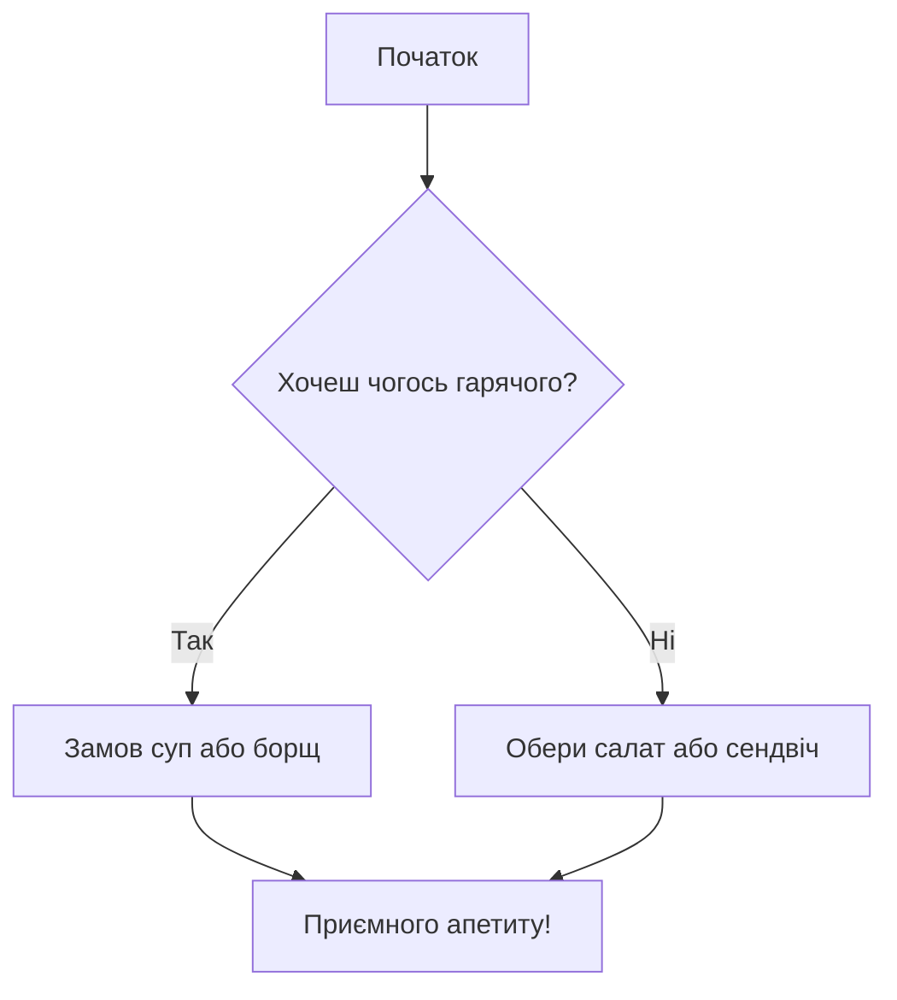

# Лабораторна робота №3
## Тема: Markdown - створення документа, діаграми та публікація на Github
### Мета роботи
Навчитися створювати структурований документ у Markdown, додавати списки, математичні формули, діагарми (Mermaid), конвертувати Markdown у HTML/ DOCX/ PDF і опублікувати результат на Github
### Мої улюблені книги:
* **"Час жити і вмирати"** - *Еріх Марія Ремарк*
* **"Гарних дівчат не вбивають"** - *Холлі Джексон*
* **"1984"** - *Джордж Оруел*
* **"Гордість і упередженість"** - *Джейн Остін*
* **"Пригоди Шерлока Холмса"** - *Артур Конан Дойл*

### Відомі математичні формули

#### 1. Закон Ома для ділянки ланцюга
Закон, що пов'язує силу струму, напругу та опір, описується формулою:
$$
I = \frac{U}{R}
$$

#### 2. Формула Ньютона-Лейбніца
Пов'язує поняття інтегрування та диференціювання, як показано у рівнянні:
$$
\int_{a}^{b} f(x)\,dx = F(b) - F(a)
$$

#### 3. Теорема Піфагора
Формула, що пов'язує довжини сторін прямокутного трикутника:
$$
a^2 + b^2 = c^2
$$

### Проста діаграма

```mermaid
graph TD
    A[Початок] --> B{Хочеш чогось гарячого?};
    B -- Так --> C[Замов суп або борщ];
    B -- Ні --> D[Обери салат або сендвіч];
    C --> E[Приємного апетиту!];
    D --> E;
``` 

### Таблиця улюблених книг

| № | Назва книги та автор | Кількість сторінок |
| :---: | :--- | :---: |
| 1 | "Час жити і помирати" - Еріх Марія Ремарк | 400 |
| 2 | "Гарних дівчат не вбивають" - Холлі Джексон | 272 |
| 3 | "1984" - Джордж Оруел | 328 |
| 4 | "Гордість і упередженість" - Джейн Остін | 384 |
| 5 | "Пригоди Шерлока Холмса" - Артур Конан Дойл | 352 |

### Контрольні запитання
**1.Що таке Markdown і для чого він використовується?**
Легка мова розмітки, яка дозволяє форматувати текст за допомогою простих символів, зберігаючи його читабельність у вихідному вигляді.

**2.Які основні елементи форматування підтримує Markdown?**
Заголовки, форматування тексту, списки, цитати, посилання, зображення, таблиці, код та горизонтальні лінії.

**3.Як у Markdown вставляються формули LaTeX? Наведіть приклади інлайн і блочної формули**
Формули LaTeX вставляються, використовуючи символи долара: одинарний $ для формул у тексті (вбудованих) та подвійний $$ для формул, які розташовані на окремому рядку.

**4.Що таке Mermaid і як додати просту діаграму у Markdown?**
Це інструмент, який дозволяє створювати схеми, діаграми та візуалізації, використовуючи текстовий синтаксис, схожий на Markdown. Щоб додати просту діаграму у Markdown, потрібно помістити код діаграми всередину блоку коду, вказавши тип мови як mermaid. 

**5.Як виконати конвертацію Markdown у формати HTML, DOCX і PDF за допомогою Pandoc?**
Щоб конвертувати Markdown у формати HTML, DOCX та PDF за допомогою Pandoc, треба використати відповідні команди в терміналі: pandoc input.md -o output.html, pandoc input.md -o output.docx та pandoc input.md -o output.pdf.

**6.Яка структура типового проєкту Markdown на GitHub?**
Типовий проєкт Markdown на GitHub має ієрархічну структуру, яка зазвичай включає основний файл README.md у кореневому каталозі та допоміжні файли Markdown (наприклад, інструкції, документація) та інші активи, організовані в окремі папки (наприклад, docs/ або images/).

**7.Як налаштувати GitHub Pages для публікації HTML-файлу?**
Щоб налаштувати GitHub Pages для публікації HTML-файлу, треба створити репозиторій з іменем username.github.io, завантажити index.html та інші файли (наприклад, style.css) у кореневий каталог репозиторію, а потім увімкнути GitHub Pages в налаштуваннях репозиторію.

**8.У чому переваги зберігання документації у Markdown перед традиційними текстовими форматами?**
Перевага Markdown полягає в тому, що він дозволяє створювати легко читабельний, портативний і структурований документ, який можна швидко перетворювати в HTML, PDF або інші формати, зберігаючи при цьому контроль версій на платформах, як GitHub.

**9.Які проблеми можуть виникати при конвертації у PDF і як їх вирішити?**
При конвертації Markdown у PDF найчастіше виникають проблеми з втратою або неправильним застосуванням стилів (CSS), що порушує візуальне оформлення документа. Складнощі також створюють складні елементи, такі як математичні формули (LaTeX) та діаграми (Mermaid), які вимагають використання потужних зовнішніх конвертерів (наприклад, Pandoc з встановленим LaTeX). Рішенням є використання спеціалізованого CSS для друку, попередня конвертація діаграм Mermaid у статичні зображення та забезпечення коректних абсолютних шляхів до всіх графічних файлів.

**10.Які вимоги до оформлення звіту згідно цієї лабораторної роботи?**
Написати заголовок та короткий опис роботи, створити маркований або нумерований список, принайми три відомі формули, використовуючи інлайн та блочні математичні формули у LaTex, побудувати просту діаграму, створити таблицю і написати короткі висновки, використовувати рекомендовану структуру репозиторію: "docs/
report.md # основний файл звіту
sample_diagram.mmd # (опційно) окремий файл з Mermaid
dist/
report.html
report.docx
report.pdf
README.md"

### Висновки

В ході лабораторної роботи успішно досягли поставленої мети - набуття навичок створення структурованого документа у форматі Markdown. Опанували ключовий синтаксис, реалізували оформлення ієрархічних заголовків, маркованих списків, математичних формул та побудували просту діаграму. 
